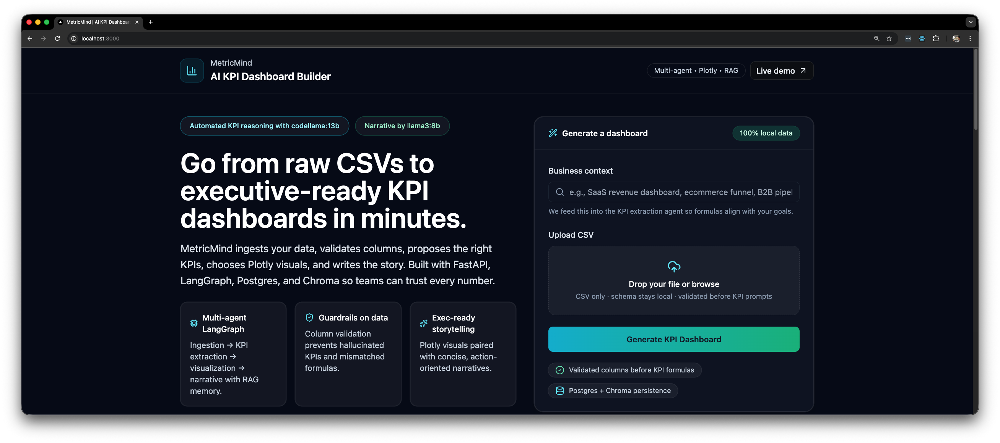
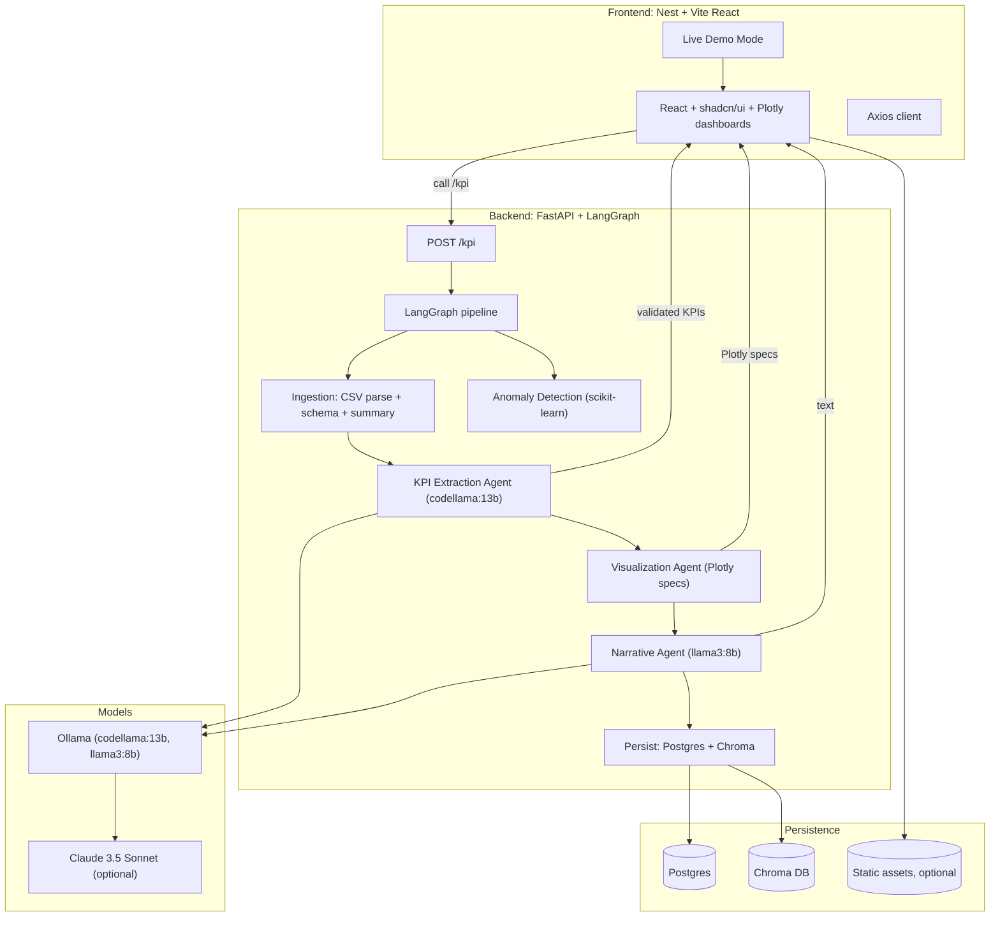

# MetricMind – AI KPI Dashboard Builder

MetricMind turns raw business data (e.g., CSVs) into executive-friendly KPI dashboards with AI-driven extraction, visualization, and narrative. The stack combines a FastAPI backend, LangGraph multi-agent orchestration, Postgres/Chroma persistence, and a Nest-served React (Vite) frontend with Plotly visuals.

## Features
- Multi-agent pipeline: ingestion → KPI extraction → visualization → narrative → persistence.
- Data validation to avoid hallucinated columns; KPI formulas reference real schema.
- Plotly.js charts rendered via a Vite + React client, served by Nest.js.
- RAG with Chroma to reuse prior dashboard decisions.
- CLI for scripted dashboard generation.

## Tech Stack
- Backend: FastAPI, LangGraph, Pandas, SQLAlchemy, Postgres, Chroma, Ollama (codellama:13b, llama3:8b) with Claude 3.5 hooks.
- Frontend: React (Vite), shadcn/ui, Plotly.js, Zustand; served by Nest.js.
- DevOps: Docker/Docker Compose, GitHub Actions (lint/test/build), Tailwind styling for UI.

## Repository Layout
- `backend/` – FastAPI app (`app/main.py`, `api/routes_kpi.py`, `graphs/kpi_graph.py`, agents, models).
- `frontend/` – Nest server + Vite React client (`client/src/**/*`).
- `cli/` – Python CLI (Typer style).
- `docs/` – Specs and diagrams.
- `tests/` – Backend tests and fixtures (e.g., `tests/data/ecommerce_daily.csv`).
- `docker-compose.yml` – Postgres, Chroma, backend, frontend services.

## Run Locally
Backend:
```bash
cd backend
python -m venv .venv && source .venv/bin/activate
pip install -r requirements.txt
uvicorn app.main:app --reload  # serves /kpi
```

Frontend (client + server):
```bash
cd frontend
npm install
npm run client:dev   # Vite on :5173
npm run start:dev    # Nest on :3000 (serves built client if present)
```

Docker Compose:
```bash
docker compose up --build
```

Environment:
- Frontend expects `VITE_API_BASE` (defaults to `http://localhost:8000`); docker-compose sets it to `http://backend:8000`.

## Key Flows
- `/kpi` POST accepts context + CSV content or URL, runs LangGraph pipeline, returns KPIs, Plotly specs, and narrative.
- Visualization agent maps schema/numerics to charts; narrative agent summarizes trends; results are persisted to Postgres and vectorized to Chroma.
- Frontend consumes the API, renders KPI cards, charts, and executive narrative. A Live Demo mode shows a full dashboard without backend calls.

## Testing
- Backend: `pytest tests`
- Frontend: `npm test` (from `frontend/`; Vitest + Testing Library)

## Notes
- Update `frontend/src/app.module.ts` ServeStatic exclusions if API prefix changes.
- Plotly bundles are large; expect Vite chunk warnings unless code-splitting is added.

## Demo Assets
- Screen recording walkthrough (download/play locally): [demo.mov](demo/demo.mov)
- Static capture of the dashboard:  
  

## Architecture (Mermaid)


## LLM and Ollama Interaction
- The backend talks to a local Ollama server for model inference:
  - `codellama:13b` handles KPI extraction, validation prompts, and code-like reasoning.
  - `llama3:8b` generates executive narratives and takeaways.
- Configure the Ollama host/port via environment variables (e.g., `OLLAMA_HOST=http://localhost:11434`); avoid hardcoding to keep deployments portable.
- Claude 3.5 Sonnet is wired as an optional fallback—keep keys out of code and use env vars or secrets management.
- Keep the models local to prevent data egress; ensure CSV content and schema stay on-box when invoking Ollama.
- If running inside Docker, expose the Ollama port to the backend service or add an internal network alias (e.g., `ollama:11434`) and update backend config accordingly.
